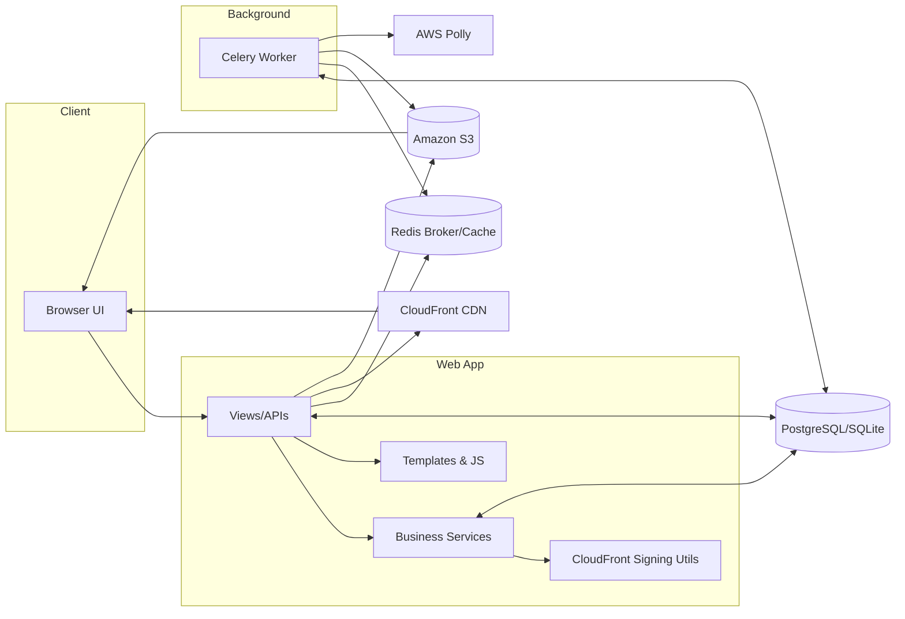
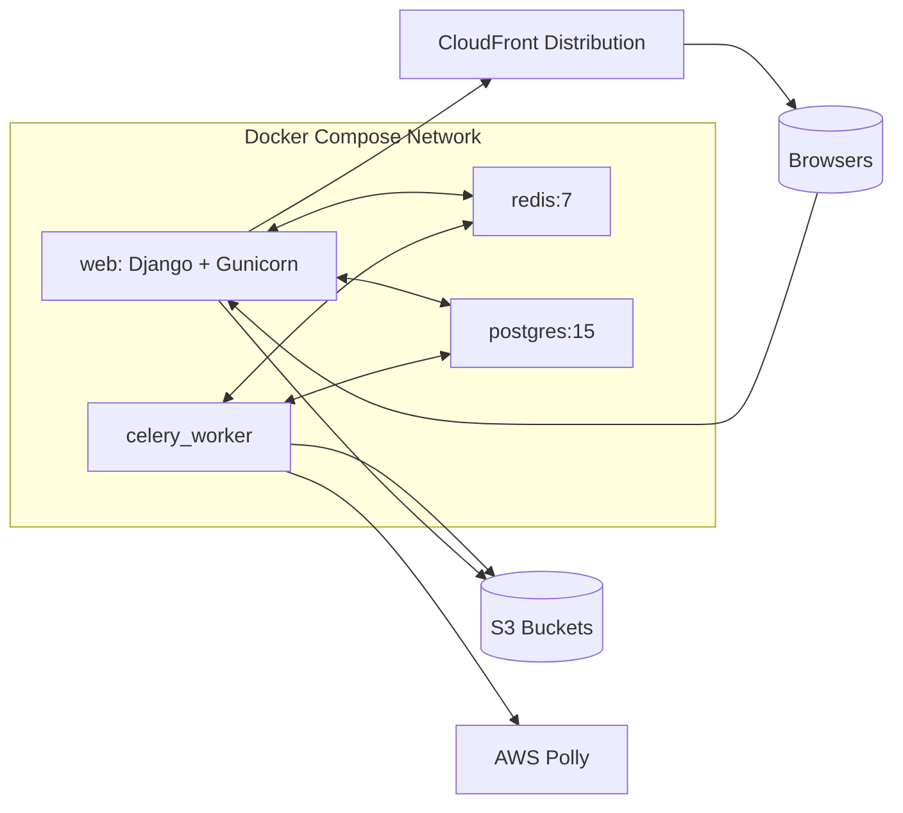

# TextToSpeechProject – System Architecture

This document is a comprehensive, practical guide to the system’s architecture: components, deployments, configs, security, data flows, and operational practices. It links out to deeper diagrams and schema docs when you need them.

## Table of contents

- Overview
- Component and deployment diagrams
- Application architecture (apps and responsibilities)
- Data and request flows (with links to DFDs)
- Storage and CDN
- Background processing and rate limiting
- Configuration and environment matrix
- Security model and trust boundaries
- API surface (key endpoints)
- Observability: logging, metrics, alerts
- Performance and scalability notes
- Operational runbooks (deploy, rotate keys, incident handling)
- Future improvements

---

## Overview

This project is a Django-based Text-to-Speech (TTS) web application that lets users upload/process documents and generate playable audio via AWS Polly. Media is stored in Amazon S3 and delivered to clients via Amazon CloudFront using signed URLs. Background jobs (audio generation, longer-running tasks) are handled with Celery using Redis as the broker and result backend. PostgreSQL is the primary database in docker-compose environments; SQLite is used by default in base settings.

High-level components:

- Web app: Django (apps: `core`, `document_processing`, `speech_processing`, `users`, `landing`)
- Worker: Celery worker process
- Caching / Broker: Redis
- Database: PostgreSQL (docker-compose), SQLite in base settings
- Object storage: Amazon S3
- CDN: Amazon CloudFront (signed URLs for media)
- TTS provider: AWS Polly (via boto3)

Deployment targets:

- Development: `docker-compose.dev.yml` with hot-reload and dev tooling
- Production: `docker-compose.prod.yml` using a multi-stage Dockerfile

---

## Component and deployment diagrams

### Component diagram (logical)

### Deployment diagram (containers and externals)

Ports and endpoints (compose):
- web: 8000/tcp exposed to host (maps to Django app)
- redis: 6379/tcp (internal and optionally exposed in dev)
- db: 5432/tcp (internal and optionally exposed in dev)

## Application architecture

### Django apps and responsibilities

- core

  - Global settings (environment-specific in `core/settings`)
  - CloudFront utilities: `core/cloudfront_utils.py` generates RSA-SHA1 signed URLs
  - Security utils, middleware, health checks, decorators
  - Logging config and cache/rate limit setup (Redis)

- document_processing

  - Document and page models, forms, admin, and storage backends
  - Template: `templates/document_processing/page_detail.html` renders the document page UI and audio player (with JS fetching audio URLs)
  - Responsible for the document viewing/editing experience

- speech_processing

  - Audio generation business logic and orchestration in `speech_processing/services.py`
  - AWS interactions (Polly synthesis; S3 uploads) through services (uses `boto3` under the hood)
  - Views/endpoints for:
    - Listing page audios: `/speech/page/<page_id>/audios/`
    - Download (get presigned URL) for audio: `/speech/audio/<audio_id>/download/`
    - Play tracking, delete, retry, sharing APIs
  - Celery tasks in `speech_processing/tasks.py` for background processing

- users

  - Custom user model and authentication (Django + django-allauth configured in `core/settings/base.py`)
  - Stores user preferences (e.g., preferred voice)

- landing
  - Marketing/landing pages and simple views

### Data and request flow

- Document viewing flow

  1. User navigates to a page view (e.g., `/documents/docs/<id>/pages/<n>/`)
  2. The template `page_detail.html` loads and immediately fetches `/speech/page/<page_id>/audios/`
  3. The backend serializes available audios for that page, including computed metadata
  4. The FE renders a list and defers loading the actual audio `src` until the user presses play

- Audio playback flow

  1. On first play, JS calls `/speech/audio/<audio_id>/download/`
  2. Backend uses `AudioGenerationService.get_presigned_url()` to obtain a fresh, time-limited URL
  3. CloudFront signed URL is attempted first via `core/cloudfront_utils.get_audio_signed_url()`
  4. If CloudFront signing fails, it falls back to an S3 presigned URL (direct `boto3`)
  5. The FE sets the returned URL as the `<audio>` element `src` and plays

- Audio generation flow
  1. User queues generation for a voice; server validates quotas/permissions
  2. Celery task synthesizes audio via AWS Polly and uploads to S3 under a deterministic key
  3. DB record is updated to `COMPLETED` with the `s3_key`
  4. Future plays use signed URLs referencing the `s3_key`

For rendered end-to-end diagrams, see: `DATA_FLOW_DIAGRAM.md`.

### Storage and CDN

- Media (audio) lives in S3.
- For production, media is accessed only via CloudFront using signed URLs (RSA-SHA1). See `core/cloudfront_utils.py`.
- Static files are delivered from a separate static CloudFront distribution and don’t require signing (`STATIC_CLOUDFRONT_DOMAIN`).

### Background processing and rate limiting

- Celery worker uses Redis as broker and result backend (see `CELERY_*` settings). A worker service runs alongside the web app in both dev/prod docker-compose files.
- django-ratelimit + Redis is used for throttling endpoints like retries (`RATELIMIT_CACHE = "ratelimit"`).

### Deployment topology (docker-compose)

- Development (`docker-compose.dev.yml`):

  - web: Django dev server with autoreload, mounts source as volume, installs dev tools (e.g., `ffmpeg`)
  - celery_worker: Celery worker (solo pool for simplicity)
  - redis: Redis 7 (broker + cache)
  - db: Postgres 15

- Production (`docker-compose.prod.yml`):
  - web: Production container built via multi-stage `Dockerfile`, starts via `/app/entrypoint.sh` (gunicorn typical)
  - celery_worker: Production container from same image
  - redis: Redis 7
  - db: Postgres 15

---

## Configuration and environment matrix

Environment selection:
- `DJANGO_SETTINGS_MODULE`: `core.settings.dev` (dev), `core.settings.production` (prod)
- `ENVIRONMENT`: development|production

Core secrets and credentials (env vars):
- `DJANGO_SECRET_KEY` (required)
- Database: `DATABASE_URL` (preferred in dev/prod), or `DB_HOST`, `DB_PORT`, `DB_NAME`, `DB_USER`, `DB_PASSWORD` (dev helper)
- Redis: `REDIS_URL` (e.g., redis://redis:6379/0)
- AWS: `AWS_ACCESS_KEY_ID`, `AWS_SECRET_ACCESS_KEY`, `AWS_DEFAULT_REGION`
- Buckets: `AWS_STORAGE_BUCKET_NAME` (media/audio), `AWS_STATIC_BUCKET_NAME` (static)
- CloudFront: `CLOUDFRONT_DOMAIN`, `CLOUDFRONT_KEY_ID`, `CLOUDFRONT_PRIVATE_KEY`, `STATIC_CLOUDFRONT_DOMAIN`
- Email (prod): `EMAIL_HOST`, `EMAIL_PORT`, `EMAIL_USE_TLS`, `EMAIL_HOST_USER`, `EMAIL_HOST_PASSWORD`, `DEFAULT_FROM_EMAIL`
- Admin contacts: `ADMINS` ("Name,email;Name,email"), `DEFAULT_ADMIN_EMAIL`
- Social auth: `GOOGLE_CLIENT_ID`, `GOOGLE_SECRET`, `GITHUB_CLIENT_ID`, `GITHUB_SECRET`

Cache config:
- Two Redis-backed caches configured: `default` and `ratelimit`
- `RATELIMIT_CACHE = "ratelimit"`

URL signing expirations (seconds):
- `CLOUDFRONT_EXPIRATION = 3600`
- `AUDIO_PRESIGNED_URL_EXPIRATION_SECONDS = 3600`

---

## Security model and trust boundaries

Trust boundaries:
- Public Internet ↔ CloudFront (signed URL gate for media)
- Public Internet ↔ Django web (authn/authz handled here)
- Internal network ↔ Redis/Postgres (isolated via Docker network)
- AWS services (S3/Polly) accessed via IAM credentials (env vars)

Key controls:
- Authentication: django-allauth with email login; email verification mandatory
- Authorization: object-level checks for document ownership/shares
- Media access: CloudFront signed URLs; fallback presigned S3 when CF unavailable
- Rate limiting: per-user retry limits via django-ratelimit (Redis-backed)
- Logging: sensitive data filtered via `core.security_utils.SensitiveDataFilter`
- Cookies (prod): `Secure`, `HttpOnly`, `SameSite=Strict` by default (configurable)
- HTTPS: `SECURE_PROXY_SSL_HEADER`, HSTS, nosniff, X-Frame-Options=DENY, etc. in production

CloudFront key management:
- Distribution for media must trust a key group that contains the public key matching `CLOUDFRONT_KEY_ID`
- If misconfigured, CloudFront returns 403; app falls back to S3 presigned URLs
- See `CLOUDFRONT_CONFIGURATION_GUIDE.md` and scripts referenced in ops docs for setup/testing

S3 object layout (convention):
- `media/` prefix used by `MediaStorage`
- `static/` prefix used by `StaticStorage` (no signing)
- Audio objects referenced by `Audio.s3_key` (deterministic per page/voice in services)

Secrets management:
- Managed via environment variables (`python-decouple`), injected by compose/host
- Avoid logging secrets; SensitiveDataFilter scrubs known keys

---

## API surface (key endpoints)

Auth required for all endpoints below unless stated.

- POST `/speech/generate/<page_id>/` — start audio generation (body: `{voice_id}`)
- GET `/speech/audio/<audio_id>/status/` — poll generation status
- GET `/speech/audio/<audio_id>/download/` — get CloudFront-signed (or S3 presigned) URL
- POST `/speech/audio/<audio_id>/play/` — record play (updates `last_played_at`)
- DELETE/POST `/speech/audio/<audio_id>/delete/` — soft delete (owner only)
- GET `/speech/page/<page_id>/audios/` — list active audios for a page
- POST `/speech/share/<document_id>/` — share document with a user
- DELETE/POST `/speech/unshare/<sharing_id>/` — remove sharing
- GET `/speech/document/<document_id>/shares/` — list shares for a document
- GET `/speech/shared-with-me/` — list documents shared with current user
- PATCH/POST `/speech/share/<sharing_id>/permission/` — update share permission
- POST `/speech/audio/<audio_id>/retry/` — retry failed generation (rate limited)

For shapes and fields, see `speech_processing/views.py` and responses inline in code.

---

## Observability: logging, metrics, alerts

Logging:
- Centralized logging configured in `LOGGING` (console handler; DEBUG for app loggers)
- Sensitive data filter enabled via `core.security_utils.SensitiveDataFilter`
- Audit trails: `AudioAccessLog` (user actions), `AdminAuditLog` (sensitive/admin actions)

Metrics (suggested additions):
- Task durations and retry counts for Celery jobs
- CloudFront vs S3 fallback rate
- Audio generation success/failure rates; Polly latency
- Per-endpoint request rates and error codes

Alerts:
- Task failures yield `TaskFailureAlert` records; consider wiring to email via production EMAIL_* settings
- Rate limit exceedances logged at WARNING

---

## Performance and scalability notes

- Celery timeouts/backoff: soft 25m, hard 30m; max_retries=3 with exponential backoff + jitter
- Redis serves as both broker and rate-limit cache; ensure adequate resources
- CloudFront preferred for media delivery; S3 fallback is functional but may increase latency and cost
- Dev image includes `ffmpeg` for `pydub`; production image currently does not—add if server-side audio post-processing is required in prod
- Database pool cap (`DATABASE_POOL_MAX_CONNECTIONS=50`) influences Redis client pool and DB usage

---

## Operational runbooks

Deploy (compose):
- Dev: `docker-compose.dev.yml` brings up web, celery_worker, redis, db; web exposed on 8000
- Prod: `docker-compose.prod.yml` uses multi-stage `Dockerfile`; configure .env with prod values

Rotate CloudFront signing keys:
- Generate new key pair (private kept secret; public attached to a Key Group)
- Update env: `CLOUDFRONT_KEY_ID`, `CLOUDFRONT_PRIVATE_KEY`
- Attach the public key to the distribution’s trusted key group for the media behavior
- Verify using the playback flow or a head-request script; monitor for 403s

Database backups (guidance):
- Use `pg_dump`/`pg_restore` for Postgres; schedule backups externally
- Ensure `TaskFailureAlert` and audit tables are included; consider retention policies

Incident: CloudFront 403 on signed URLs
- Symptom: Playback via CF fails; S3 fallback works
- Likely cause: Missing public key in trusted key group or behavior not associated with the key group
- Action: Fix key group configuration; confirm with test URL; watch fallback rate metric

---

## Python dependencies (requirements.txt) and where they are used

Below is a mapping of key dependencies to their roles. Some are transitive or framework-level libraries and used indirectly by Django/boto3/Celery.

- Django==5.2.4 – Core web framework (all apps)
- asgiref, sqlparse, tzdata – Django runtime dependencies
- django-allauth==0.63.6 – Authentication & social login; configured in `core/settings/base.py` (INSTALLED_APPS and providers)
- django-storages==1.14.6 – S3 storage backend; used in `core/settings/production.py` and custom storage backends
- django-ratelimit==4.1.0 – Rate limiting; decorators in views (e.g., `retry_audio`), cache configured in `core/settings/base.py`
- django-redis==5.4.0 – Cache backend using Redis; configured in `core/settings/base.py` for default and ratelimit caches
- gunicorn==23.0.0 – Production WSGI HTTP server; invoked from `entrypoint.sh` / Procfile
- whitenoise==6.9.0 – Static files middleware; enabled in `MIDDLEWARE` (mainly for non-CDN/dev scenarios)
- dj-database-url==1.3.0 – Parse `DATABASE_URL` for production deployments
- psycopg2-binary==2.9.10 – PostgreSQL driver; used by Django when connecting to Postgres in docker-compose/prod
- python-decouple==3.8 – Load environment variables in settings files
- boto3==1.39.3 / botocore==1.39.3 / s3transfer==0.13.0 / jmespath==1.0.1 / urllib3==2.5.0 – AWS SDK; used by `speech_processing` services to call Polly and S3; `django-storages` also leverages these
- cryptography==45.0.5 – RSA signing for CloudFront URLs in `core/cloudfront_utils.py`
- redis==5.3.0 – Redis client used by Celery/Django caches
- celery==5.5.3 / kombu==5.5.4 / amqp==5.3.1 / billiard==4.2.1 / vine==5.1.0 – Task queue stack; used by `speech_processing.tasks` and orchestration in services
- requests==2.32.4 – HTTP client; available for any external calls (not central to core flows)
- Markdown==3.8.2 / html2text==2025.4.15 / markdownify – Used in document processing to convert text/markdown/HTML
- mammoth==1.9.1 / python-docx==0.8.11 / pypandoc-binary – DOCX and multi-format conversion for document ingestion
- lxml==6.0.0 / nh3==0.2.14 – HTML parsing and sanitization
- pillow==10.4.0 – Image processing; optional features (e.g., image thumbnails if needed)
- python-dateutil==2.9.0.post0 / six==1.17.0 – Utilities for date handling, compatibility (often used indirectly)
- django-widget-tweaks==1.4.12 / django-crispy-forms / crispy-bootstrap5 – Form rendering and UI helpers used in templates and forms
- pip-audit==2.9.0 – Security scans (dev utility)
- pymupdf4llm / pymupdf – PDF parsing and extraction (document ingestion paths)
- pydub – Audio segment manipulation/merging (requires `ffmpeg` in the OS)

Notes:

- `#`-commented dependencies in requirements.txt are optional and not installed.
- `nh3` and `django-ratelimit` appear twice; the effective version is the last one pinned/declared by pip resolution (tidy-up recommended).
- Some libraries (e.g., `requests`) may be used incidentally or by utilities; the core critical paths are called out above.

## Container build dependencies (Dockerfile)

### Production image (`Dockerfile`, multi-stage)

- Base image: `python:3.11-slim-bookworm`
- Builder stage installs build tools to compile wheels:
  - `build-essential` (gcc, make, etc.)
  - `libpq-dev` (PostgreSQL client headers for `psycopg2`)
  - `gettext` (Django translations tooling)
- Production stage:
  - Copies installed Python packages from builder
  - Runs as non-root `appuser`
  - Entrypoint: `/app/entrypoint.sh`

Note: The production Dockerfile does not install `ffmpeg`. If you use `pydub`-based audio merging in production, add `ffmpeg` to the production image as well (see dev image for reference).

### Development image (`Dockerfile.dev`)

- Base image: `python:3.11-slim-bookworm`
- Installs development system packages:
  - `build-essential`, `libpq-dev`, `gettext` – same as production builder
  - `git` – for development convenience
  - `ffmpeg` – required by `pydub` for audio processing
- Runs Django’s development server with autoreload

## Configuration overview

- Environment variables: managed via `.env` and `python-decouple` in settings
- AWS integration (Base/Production settings):
  - S3 bucket names, region, credentials
  - CloudFront domains for media/static; signed URL key pair ID and private key
- Caches: Redis-backed default cache and a dedicated ratelimit cache
- Celery: Broker and backend via Redis; timeouts and retry policies specified in settings

## Key code entry points

- Frontend page + audio JS: `templates/document_processing/page_detail.html`
- Audio URL issuance (API): `speech_processing/views.py` → `download_audio` and `page_audios`
- URL generation logic: `speech_processing/services.py` → `AudioGenerationService.get_presigned_url`
- CloudFront signing: `core/cloudfront_utils.py` → `get_audio_signed_url`, `create_cloudfront_signed_url`
- Storage backends: `document_processing/storage_backends.py` and `core/settings/production.py` overrides
- Background jobs: `speech_processing/tasks.py`

## Data model highlights

- Document and Page models track content and pagination
- Audio model links to Page and stores metadata, `s3_key`, status (`PENDING`, `GENERATING`, `COMPLETED`, `FAILED`), and lifetime status (e.g., `ACTIVE`, `DELETED`)
- Sharing model allows access control to documents with permissions

## Operational notes and gotchas

- CloudFront signed URLs require the distribution’s trusted key group to include your public key (matching `CLOUDFRONT_KEY_ID`). If misconfigured, signed URLs return 403 and the service falls back to S3 presigned URLs.
- `pydub` requires `ffmpeg`. Dev image includes it; production image currently does not. Add `ffmpeg` to production if audio merging happens server-side in prod.
- Redis is required both for Celery and for django-redis caching (rate limiting). Ensure `REDIS_URL` is consistent across services.
- Static files are designed to be served via a separate CloudFront distribution in production (`STATIC_CLOUDFRONT_DOMAIN`).

## Future improvements

- Deduplicate `requirements.txt` entries (e.g., `nh3`, `django-ratelimit`)
- Consider adding `ffmpeg` to the production image if audio post-processing is required server-side
- Add health checks for Celery worker and DB readiness
- Expand automated tests to cover CloudFront signing and S3 fallback behaviors

---

## Related docs

- Database schema and ERD: `DATABASE_SCHEMA.md`
- Data flow diagrams (Level 0 and Level 1): `DATA_FLOW_DIAGRAM.md`

